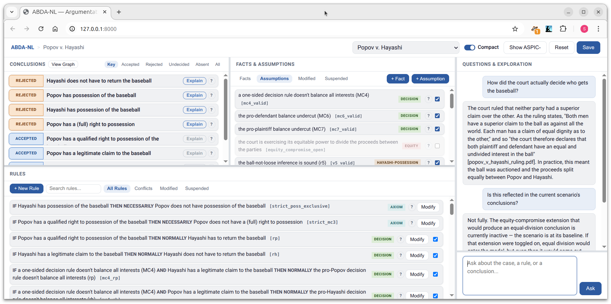

# ABDA-NL

[](https://github.com/idaks/ABDA-NL/actions/workflows/ci.yml)

ABDA-NL is a browser-based natural-language scenario explorer for
argument-based reasoning. It lets users inspect, explain, and modify ASPIC-
scenarios while the deterministic ABDA engine remains authoritative for
argument construction, attacks, and grounded labels.



## What the demo supports

- Explore six included scenarios, including the Popov v. Hayashi legal case.
- Inspect conclusions labeled accepted, rejected, undecided, or absent.
- Open an interactive explanation of the grounded discussion game.
- Suspend assumptions and rules, and change rule preferences in the Conflicts
  view to explore alternatives.
- View the argumentation framework as a graph or inspect the underlying ASPIC-
  representation.
- Save a modified scenario as a new local scenario.
- With an optional language model, ask corpus-grounded questions and propose
  new facts, assumptions, and rules in natural language. Proposals are checked
  before they can be applied, and all argumentation reasoning remains in ABDA.

The `development` branch contains experimental work on hosted accounts, usage
quotas, additional model routing, and MCP access. It is not part of the paper
artifact on `main`.

## Quick start

ABDA-NL requires Python 3.10 or newer. No API key is needed for the
deterministic explorer.

```bash
git clone https://github.com/idaks/ABDA-NL.git
cd ABDA-NL
python3 -m venv .venv
.venv/bin/python -m pip install --upgrade pip
.venv/bin/python -m pip install -e .
.venv/bin/abda-nl --basic
```

The final command starts the server on the loopback interface, waits for it to
be ready, and opens the default browser. If a browser cannot be opened, follow
the local URL printed in the terminal. Press `Ctrl+C` in that terminal to stop
the server.

Start with the Popov v. Hayashi scenario. The upper panels show conclusions,
facts, and assumptions, while the lower panel shows rules. Use **Explain** on a
conclusion to inspect its discussion-game trace. Use **View Graph** and
**Show ASPIC-** to inspect the formal structures behind the natural-language
interface.

## Optional language-model features

Chat and natural-language authoring require either an Anthropic API key or a
local model served by [Ollama](https://ollama.com/). For Anthropic, create a
gitignored `.env` file in the repository root:

```dotenv
ANTHROPIC_API_KEY=replace-with-your-key
# ABDA_LLM_MODEL=replace-with-a-model-available-to-your-account
```

Then run:

```bash
.venv/bin/abda-nl --llm
```

For a local Ollama model, set its installed model name explicitly:

```bash
ABDA_LLM_BACKEND=ollama ABDA_OLLAMA_MODEL=your-model \
  .venv/bin/abda-nl --llm
```

API keys belong only in `.env` or the shell environment. Never commit them.
The Anthropic organization associated with the key must also have available
[API usage credits](https://support.claude.com/en/articles/8977456-how-do-i-pay-for-my-claude-api-usage).

## NCSA Delta

iDAKS developers can start the repository through the shared launcher from any
Delta login node:

```bash
demo
```

The launcher reads `.demo.json`, manages the server in the background, and
keeps it on the pinned login node. On the laptop, keep `ssh delta-demo` open to
forward the service, then visit <http://127.0.0.1:8765>. Run `demo doctor` on
Delta if the tunnel or launcher needs diagnosis. A remote loopback address is
not directly reachable from a laptop without that SSH session.

## Tests

Install the development dependencies and run the test suite:

```bash
.venv/bin/python -m pip install -e '.[dev]'
make test
.venv/bin/python -m ruff check app tests
```

The CI workflow also checks a clean wheel installation and exercises the main
reader path in a real Chromium browser.

## Paper and citation

ABDA-NL accompanies:

> Shawn Bowers, Martin Caminada, Haoyang Liu, and Bertram Ludäscher.
> **ABDA-NL: A Natural-Language Scenario Explorer for Argument-Based
> Reasoning.** Demonstration paper, COMMA 2026.

Machine-readable citation metadata is available in
[`CITATION.cff`](CITATION.cff). Please use the paper citation when referring to
the research contribution.

## License

ABDA-NL is released under the [MIT License](LICENSE).
